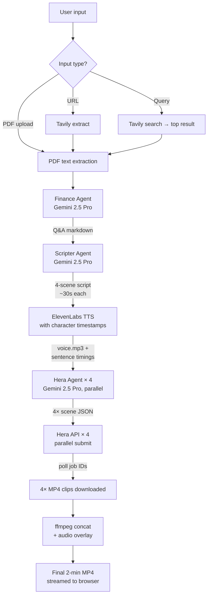

# CorpuScan


> CorpuScan turns dense financial documents into short, polished executive video briefings.

Built for **Big Tech Berlin 2026**, CorpuScan helps teams go from quarterly report to boardroom-ready summary without spending hours reading, rewriting, recording, and assembling slides by hand.

## Team

Built at **Big Tech Berlin 2026** by [**Javier Peres**](https://github.com/peres84) and [**Sebastian Russo**](https://github.com/rouxxel).

## Demo and results

Click on the logo to see the demo
[](https://youtu.be/-YFkeoVrajU)

- Output video results: [Briefing video results](https://drive.google.com/drive/folders/1a4klVgh3VlUttX9CAWF3r7kcYkuUEPBN?usp=drive_link)
- Report examples: [Quarterly report pdf files](https://drive.google.com/drive/folders/1IEyToMzFP6JdemquRUPNWEr83oZafCKT?usp=drive_link)

## The problem

Quarterly reports, investor updates, and earnings materials are packed with signal, but they are slow to consume and even slower to communicate. Founders, finance teams, investor relations, and internal comms teams often need to:

- read long and repetitive source material
- extract the few numbers that actually matter
- rewrite that information into plain English
- turn it into something visual enough to share internally or externally

That work is usually fragmented across documents, slides, scripting, narration, and video editing tools.

## What we are solving

CorpuScan compresses that workflow into one pipeline:

- ingest a PDF, URL, or research query
- extract the most relevant financial facts
- turn them into a concise 4-scene script
- generate voiceover with timing alignment
- render motion graphics scene by scene
- deliver a playable MP4 in the browser

The value is not just "making video." The value is **turning dense information into clear communication**.

## Who it is for

- investor relations teams
- founders and finance teams
- strategy and analyst teams
- internal communications teams

---

## How it works



---

## Why this approach

We intentionally designed CorpuScan as a fast MVP instead of a heavyweight media platform:

- no database
- no queue
- no auth
- no persistent storage
- one backend process

That keeps the product easy to demo, easy to reason about, and fast enough for a hackathon build while still solving the real communication bottleneck.

---

## Tech stack

| Layer             | Tool |
| ----------------- | ---- |
| Frontend          | React 18, Vite, TypeScript, Tailwind CSS |
| UI scaffold       | Lovable |
| UI components     | shadcn/ui, Radix UI, lucide-react |
| Backend           | FastAPI, Python 3.12, `uv` |
| LLM orchestration | Google Gemini 2.5 Pro via `google-genai` |
| Research          | Tavily Search + Extract |
| Voiceover         | ElevenLabs TTS with character timestamps |
| Motion graphics   | Hera Motion API |
| Video composition | ffmpeg |
| Testing           | Vitest, Testing Library |
| Security tooling  | Aikido |
| Dev workflow      | Entire.io |
| Frontend hosting  | Vercel |
| Backend hosting   | Railway or Fly.io |
| Storage model     | In-memory jobs + `/tmp/{job_id}/` |

---

## Architecture decisions

- **No database.** Job state lives in an in-memory `dict` on the FastAPI process. A demo session = one job. If the server restarts mid-job, the job is lost. Acceptable for MVP.
- **No queue.** The full pipeline (~60–180s) runs in a single `asyncio` background task per request. Frontend polls `GET /jobs/{id}` every 1.5s.
- **No auth.** Landing page → "Start now" → dashboard → upload. No accounts, no history.
- **No persistent file storage.** Final MP4 is streamed directly from `/tmp` to the browser; user downloads. No S3, no Vercel Blob.
- **All third-party keys are server-side.** Frontend never touches Gemini, Tavily, ElevenLabs, or Hera directly.

---

## Repo layout

```
.
├── README.md            ← this file
├── CLAUDE.md            ← entry point for Claude Code
├── AGENTS.md            ← conventions for any AI coding agent
├── docs/
│   ├── PRD.md              ← product requirements
│   ├── TASK.md             ← build checklist
│   ├── lovable-prompt.md   ← paste this into Lovable to scaffold the frontend
│   ├── branding.md         ← brand voice + color tokens
│   └── hera-api.md         ← Hera API reference and prompting guide
├── frontend/            ← React + Vite + Tailwind (Vite dev server on :8080)
└── backend/
    ├── app/agents/      ← Finance / Scripter / Hera agent runners
    └── app/prompts/     ← YAML system prompts (one file per agent)
```

---

## Local development

```bash
# Backend
cd backend
uv sync
cp .env.example .env       # fill in GEMINI_API_KEY, TAVILY_API_KEY, ELEVENLABS_API_KEY, HERA_API_KEY
uv run uvicorn app.main:app --reload --port 8000

# Frontend
cd frontend
pnpm install
echo "VITE_API_BASE_URL=http://localhost:8000" > .env.local
pnpm dev
```

System dependency: **ffmpeg** must be on `PATH`. Install via `brew install ffmpeg` (macOS) or `apt install ffmpeg` (Debian/Ubuntu / Docker base image).

### Environment variables

| Variable | Required | Description |
| -------- | -------- | ----------- |
| `GEMINI_API_KEY` | Yes | Google AI Studio key |
| `TAVILY_API_KEY` | Yes | Tavily search/extract key |
| `ELEVENLABS_API_KEY` | Yes | ElevenLabs API key |
| `ELEVENLABS_VOICE_ID` | Yes | ElevenLabs voice ID for narration |
| `HERA_API_KEY` | Yes | Hera Motion API key |
| `VITE_API_BASE_URL` | Frontend | Backend base URL (default: `http://localhost:8000`) |

Optional backend tuning vars (`HERA_BASE_URL`, `HERA_RENDER_TIMEOUT_SECONDS`, `CORS_ORIGINS`, etc.) are documented in [backend/README.md](backend/README.md).

### Docker (backend only)

```bash
docker build -t corpuscan-backend ./backend
docker run --env-file backend/.env -p 8000:8000 corpuscan-backend
```

---

## API at a glance

| Method | Path | Description |
| ------ | ---- | ----------- |
| `GET` | `/health` | Liveness check — returns `{"ok": true}` |
| `POST` | `/generate` | Submit a job (PDF file, URL, or query). Returns `{"job_id": "..."}` |
| `GET` | `/jobs/{job_id}` | Poll status — `pending` → `running` → `done` \| `error` |
| `GET` | `/jobs/{job_id}/video` | Stream the final MP4. Append `?download=1` to force download |

Frontend polls `/jobs/{id}` every 1.5 s. Full request/response shapes are in [backend/README.md](backend/README.md).

---

## Demo flow

1. Open the landing page → **Start now**.
2. Drag a quarterly report PDF (or paste a URL, or type "Apple Q4 2025 earnings").
3. Click **Generate video**.
4. Watch the 6-step pipeline indicator tick through (~2 minutes).
5. Embedded video player loads. **Download MP4**.

---

## Status

Hackathon MVP — see [docs/TASK.md](docs/TASK.md) for the live checklist.

For deeper dives: [frontend/README.md](frontend/README.md) covers routes, design system tokens, and component structure. [backend/README.md](backend/README.md) covers the full pipeline, all env vars, agent prompt editing, and Docker.

